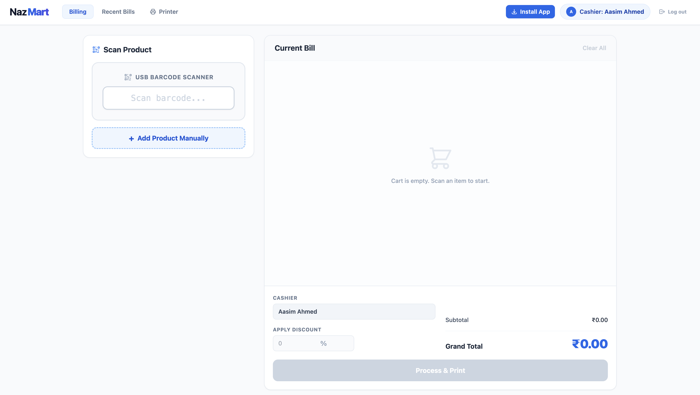
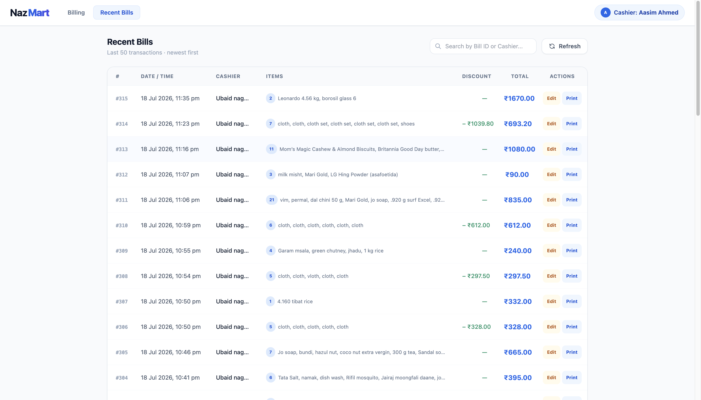
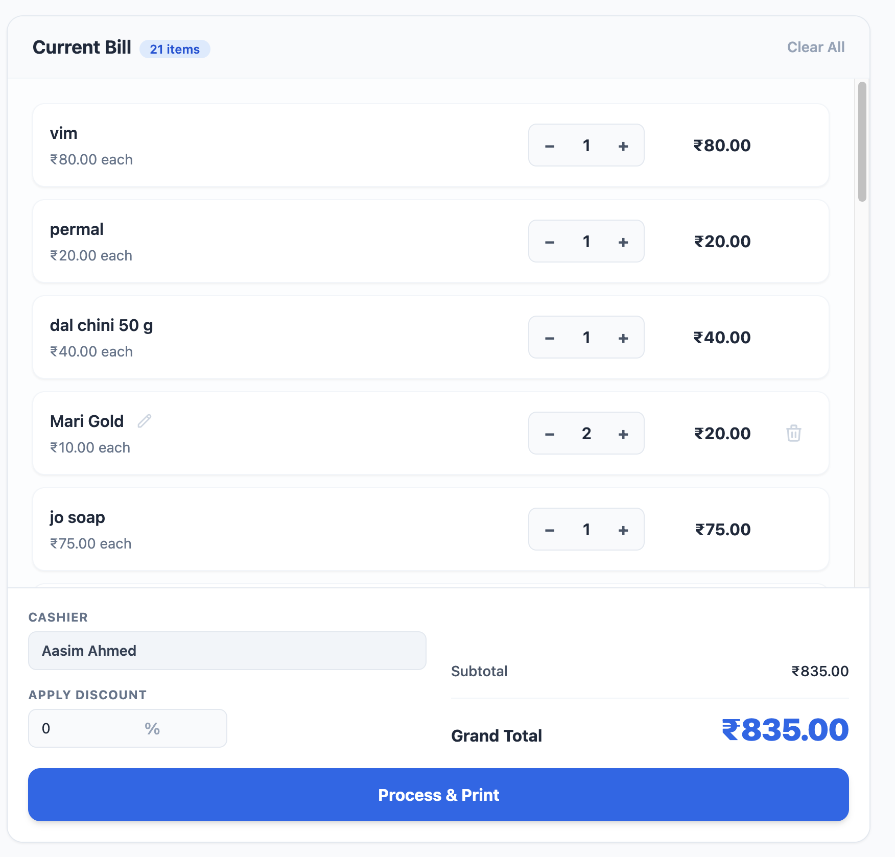
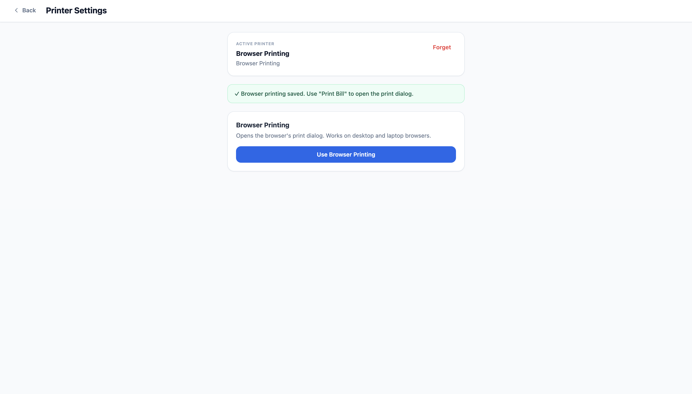

## 📸 Application Preview

NazMart provides a modern and intuitive Point of Sale (POS) interface designed for retail businesses. The application enables fast barcode scanning, efficient billing, inventory-friendly workflows, recent bill management, and seamless receipt printing through a clean and responsive user interface.

| Billing Dashboard | Recent Bills |
| ----------------- | ------------ |
|  |  |

| Billing Workflow | Printer Settings |
| ---------------- | ---------------- |
|  |  |

---

# ✨ Features

## 🛒 Smart Billing
- Fast barcode-based product scanning
- Manual product creation during billing
- Automatic quantity management
- Real-time subtotal and grand total calculation
- Percentage-based discount support

---

## 📦 Inventory Management
- Barcode product lookup
- Create new products instantly
- Update existing products
- Inventory-friendly product structure

---

## 🧾 Bill Management
- View recent transactions
- Edit previously created bills
- Reprint receipts anytime
- Search bills by Bill ID or Cashier

---

## 🖨️ Printing
- Browser printing support
- Bluetooth thermal printer support
- ESC/POS compatible printing
- Receipt preview before printing

---

## 📱 Modern Experience
- Progressive Web App (PWA)
- Responsive desktop interface
- Mobile-ready with Capacitor
- Fast and lightweight React application

---

## 🔒 Reliability
- Production-ready architecture
- Modular component structure
- Centralized API layer
- Shared utilities and reusable hooks
- Clean separation of business logic

---

# 🏗️ Frontend Architecture

NazMart follows a modular and scalable React architecture that separates UI components, business logic, API communication, and shared utilities. This structure keeps the codebase maintainable, reusable, and easy to extend.

```text
                           User
                             │
                             ▼
                    React Application
                             │
        ┌────────────────────┼────────────────────┐
        ▼                    ▼                    ▼
      Pages              Components            Services
        │                    │                    │
        ▼                    ▼                    ▼
     Custom Hooks ─────► Shared Utilities ◄──── API Layer
                             │
                             ▼
                    Express.js REST API
                             │
                             ▼
                      PostgreSQL Database
```

### Architecture Overview

- **Pages** handle application-level screens and route composition.
- **Components** provide reusable UI elements across the application.
- **Custom Hooks** encapsulate business logic and state management.
- **Services** manage printing and external integrations.
- **API Layer** centralizes all backend communication through reusable modules.
- **Shared Utilities** provide common helpers, calculations, formatting, and constants.
- **Backend** exposes REST APIs built with Express.js.
- **Database** persists products and billing data using PostgreSQL.

---

# 🛠️ Tech Stack

NazMart Frontend is built using a modern React ecosystem designed for performance, scalability, and maintainability.

| Category | Technologies |
|----------|--------------|
| **Frontend** | React 19, Vite 7, JavaScript (ES6+) |
| **Styling** | Tailwind CSS |
| **HTTP Client** | Axios |
| **Barcode Scanning** | ZXing (`@zxing/browser`, `@zxing/library`) |
| **Mobile Support** | Capacitor |
| **Printing** | Browser Printing, Bluetooth Thermal Printing (ESC/POS) |
| **Progressive Web App** | Vite PWA Plugin |
| **State Management** | React Hooks |
| **Backend API** | Node.js + Express.js REST API |
| **Database** | PostgreSQL (Neon) |
| **Deployment** | Render |
| **Version Control** | Git & GitHub |

---

---

# 📁 Project Structure

The frontend follows a modular architecture to keep the codebase scalable, maintainable, and easy to extend.

```text
billing-frontend/
│
├── assets/                 # README assets & screenshots
├── public/                 # Static files
├── src/
│   ├── api/                # Centralized API communication
│   ├── assets/             # Application assets
│   ├── components/         # Reusable UI components
│   ├── constants/          # Shared configuration & constants
│   ├── hooks/              # Custom React hooks
│   ├── pages/              # Application pages
│   │   └── Billing/        # Billing page modules
│   ├── services/           # Printing & external integrations
│   ├── utils/              # Shared helper functions
│   ├── App.jsx
│   └── main.jsx
│
├── package.json
├── vite.config.js
└── README.md
```

## 📂 Folder Responsibilities

| Folder | Purpose |
|---------|---------|
| **api/** | Centralized communication with the backend REST API |
| **components/** | Reusable UI components shared across pages |
| **constants/** | Global configuration values and application constants |
| **hooks/** | Custom React hooks containing reusable business logic |
| **pages/** | Top-level application screens |
| **services/** | Printing services, Bluetooth integration, and external functionality |
| **utils/** | Shared helper functions, calculations, and formatting utilities |
| **assets/** | Images, icons, and static resources used by the application |

---

---

# 🚀 Getting Started

Follow the steps below to run NazMart Frontend locally.

## 📋 Prerequisites

Make sure you have the following installed:

- Node.js **20+**
- npm **10+**
- Git
- NazMart Backend API running locally or deployed

---

## 📥 Clone the Repository

```bash
git clone https://github.com/aasim-ahmed/nazmart-frontend.git
cd nazmart-frontend
```

---

## 📦 Install Dependencies

```bash
npm install
```

---

## ⚙️ Configure Environment Variables

Create a `.env` file in the project root.

Example:

```env
VITE_API_BASE_URL=http://localhost:10000/api
```

For production:

```env
VITE_API_BASE_URL=https://bill-backend-w5f7.onrender.com/api
```

---

## ▶️ Start Development Server

```bash
npm run dev
```

Application will be available at:

```
http://localhost:5173
```

---

## 🏗️ Production Build

```bash
npm run build
```

Preview the production build locally:

```bash
npm run preview
```

---

---

# 🌐 Deployment

NazMart Frontend is deployed as a production-ready web application and communicates with the NazMart Backend through a REST API.

## Live Demo

🌍 **https://www.nazmart.store**

---

## Production Stack

| Layer | Technology |
|--------|------------|
| Frontend | React + Vite |
| Backend | Express.js |
| Database | PostgreSQL (Neon) |
| Deployment | Render |
| Mobile | Capacitor |
| Printing | Browser + Bluetooth Thermal Printer |

---

## Production Architecture

```
User
   │
   ▼
NazMart Frontend (React)
   │
   ▼
REST API
   │
   ▼
NazMart Backend (Express.js)
   │
   ▼
PostgreSQL (Neon)
```

The frontend communicates with the backend through a centralized API layer. Business logic remains on the server while the frontend focuses on delivering a fast, responsive, and intuitive user experience.

---
---

# 🚀 Roadmap

The following enhancements are planned for future releases.

- [x] Barcode Scanning
- [x] Smart Billing
- [x] Product Management
- [x] Bill Editing
- [x] Recent Bills
- [x] Browser Printing
- [x] Bluetooth Thermal Printing
- [x] Progressive Web App (PWA)

### Planned Features

- [ ] User Authentication
- [ ] Role-Based Access Control
- [ ] Sales Analytics Dashboard
- [ ] Inventory Reports
- [ ] Customer Management
- [ ] Offline Data Synchronization
- [ ] Multi-Store Support
- [ ] GST Reports
- [ ] Dark Mode

---
---

# 🤝 Contributing

Contributions, suggestions, and bug reports are welcome.

If you would like to improve NazMart:

1. Fork the repository.
2. Create a feature branch.
3. Commit your changes.
4. Open a Pull Request.

Please ensure all changes follow the existing project structure and coding style.

---

# 📄 License

This project is licensed under the **MIT License**.

See the `LICENSE` file for more information.
